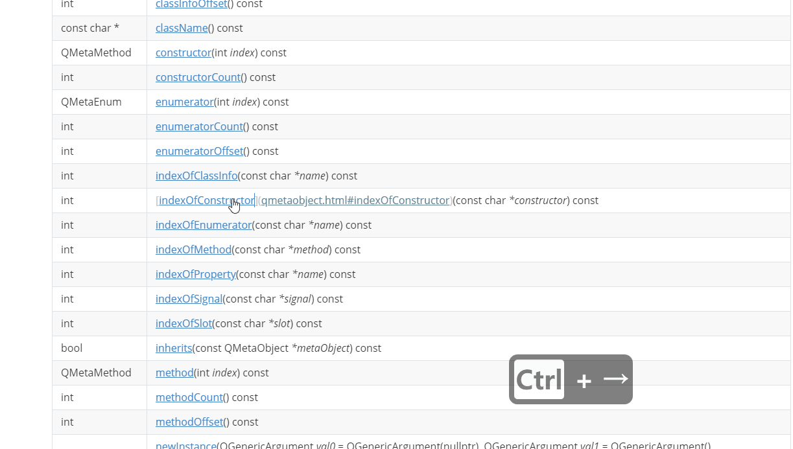

# Tools
辅助中文文档编写的辅助工具


## IndexLauncher



索引工具，可自动导入文件夹下所有 `.md` 文件，生成索引。

提供类似 Mac 中的 Alfred、Linux KDE 中的 klauncher， 以及第三方软件 WOX 的类似功能。

通过特定快捷键可唤起检索界面，通过键盘输入选取文件和标题，回车后将其链接复制至剪贴板。

使用说明详见软件内帮助。


## Qt文档链接修复工具（Qtdoc Markdown Link Fixer)

用于将 Qt 官网的文档经typora转化后的 Markdown 中原链接修复为根据 Qt 中文文档项目的链接规范定义的链接。

# 安装

``` bash
pip3 install -e "git+https://github.com/QtDocumentCN/Tools.git#egg=qmlf&subdirectory=qmlf"
```

# 使用

1. 复制待翻译的 Qt 文档页面内容
2. 粘贴至 Typora 中，自动转换为 Markdown，保存（注意文件名需规范）
3. 执行`qmlf <文档网页链接> <markdown 文件名>`自动修复链接
4. 手动调整部分无法自动修复的链接。

[示例视频](./qmlf/example.mp4)
